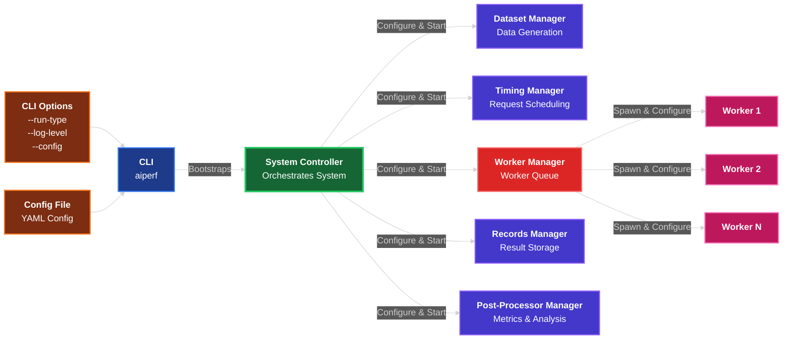

<!--
# SPDX-FileCopyrightText: Copyright (c) 2025 NVIDIA CORPORATION & AFFILIATES. All rights reserved.
# SPDX-License-Identifier: Apache-2.0
-->
# AIPerf Developers Guide

This guide will help you set up your development environment and understand the AIPerf system architecture.

## Quick Start

### Prerequisites
- Python 3.10 or higher
- Linux environment (preferred)

### Development Environment Setup
**Choose ONE option below!**

#### Option A: Devcontainer (Preferred)
Supported by:
- VS Code
- Cursor
- Pycharm

Use your IDE to re-open the project folder inside the devcontainer. Usually available as a popup when you first load the project.
This will automatically build and install all required dependencies

#### Option B: Using Make (Native Alternative)
<details>

```bash
make first-time-setup
```
This command will:
- Install uv if not present
- Create a virtual environment
- Install dependencies
- Install pre-commit hooks

</details>

#### Option C: Manual (Native Alternative)
<details>

```bash
# Install uv package manager
curl -LsSf https://astral.sh/uv/install.sh | sh

# Create virtual environment
uv venv --python 3.12

# Activate virtual environment
source .venv/bin/activate

# Install package in editable development mode
uv pip install -e ".[dev]"

# Install pre-commit hooks
pre-commit install --install-hooks
```
</details>

### Running AIPerf

- **Default mode**:
  ```bash
  aiperf
  
  # also same as running
  aiperf --run-type process
  ```

- **Kubernetes mode (not yet supported)**:
  ```bash
  aiperf --run-type k8s
  ```

- **With debug logging**:
  ```bash
  aiperf --log-level DEBUG
  ```

- **View all options**:
  ```bash
  aiperf --help
  ```

Press `Ctrl-C` to stop the process normally.

> Note: Press `Ctrl-Z` followed by `disown`, then `pkill -9 aiperf` if the process gets "stuck".

Each process is named after the service_id. To see the running processes, run:
```bash
pgrep -a "aiperf

2879138 aiperf system_controller_e3291509
2879170 aiperf dataset_manager_d821a161
2879173 aiperf timing_manager_5e8caf4b
2879175 aiperf worker_manager_77393965
2879177 aiperf records_manager_c16acdb0
2879179 aiperf post_processor_manager_d595537b
```

## Development Commands

The project includes an optional Makefile for common development tasks:

```bash
make help              # Show all available commands
make test              # Run tests
make test-verbose      # Run tests with debug logging
make coverage          # Run tests with coverage report
make lint              # Run linting with ruff
make lint-fix          # Auto-fix linting issues
make format            # Format code with ruff
make check-format      # Check code formatting
make clean             # Clean up cache files
make docker            # Build docker image
make install           # Install in editable mode
```

You can also look inside at the commands it runs if you prefer to run things manually.

## Project Architecture

### Directory Structure

```
aiperf/
├── aiperf/                      # Main Python package
│   ├── cli.py                   # Command line interface
│   ├── common/                  # Shared utilities and components
│   │   ├── bootstrap.py         # Service bootstrapping
│   │   ├── comms/               # Communication system
│   │   │   ├── base.py          # Base communication classes
│   │   │   ├── client_enums.py  # Client type definitions
│   │   │   └── zmq/             # ZeroMQ implementation
│   │   ├── config/              # Configuration management
│   │   │   ├── service_config.py # Service configuration models
│   │   │   └── loader.py        # Configuration loading utilities
│   │   ├── service/             # Base service framework
│   │   │   ├── base_service.py              # Core service implementation
│   │   │   ├── base_service_interface.py    # Service interface definition
│   │   │   ├── base_component_service.py    # Component service base
│   │   │   └── base_controller_service.py   # Controller service base
│   │   ├── enums.py             # System-wide enumerations
│   │   ├── models.py            # Pydantic data models
│   │   ├── exceptions.py        # Custom exception classes
│   │   ├── factories.py         # Service factory patterns
│   │   ├── hooks.py             # Service lifecycle hooks
│   │   ├── tokenizer.py         # Text tokenization utilities
│   │   └── utils.py             # General utilities
│   ├── services/                # Microservices implementation
│   │   ├── system_controller/   # System orchestration service
│   │   ├── dataset/             # Dataset management service
│   │   ├── timing_manager/      # Request timing and credit management
│   │   ├── worker_manager/      # Worker process management
│   │   ├── worker/              # Request execution workers
│   │   ├── records_manager/     # Result storage and management
│   │   ├── post_processor_manager/ # Result processing and metrics
│   │   └── service_manager/     # Service lifecycle management
│   └── tests/                   # Test suite
│       ├── conftest.py          # Pytest configuration
│       ├── services/            # Service-specific tests
│       ├── comms/               # Communication tests
│       └── utils/               # Utility tests
├── docs/                        # Documentation
├── tools/                       # Development tools
├── .devcontainer/               # VS Code dev container config
├── .github/                     # GitHub workflows
├── pyproject.toml               # Project configuration
├── Makefile                     # Development automation
├── Dockerfile                   # Container configuration
└── README.md                    # Project overview
```

## System Architecture

AIPerf implements a distributed microservices architecture built around a message-passing system using ZeroMQ.

### Core Services

1. **System Controller** (`system_controller`)
   - Is bootstrapped by the CLI
   - Orchestrates the entire system
   - Manages service lifecycle and health monitoring
   - Handles service registration and coordination

2. **Dataset Manager** (`dataset`)
   - Manages data generation and acquisition
   - Provides synthetic prompt/token generation
   - Handles remote dataset retrieval

3. **Worker Manager** (`worker_manager`)
   - Coordinates request distribution to workers
   - Manages timing credits from the timing manager
   - Handles worker process lifecycle

4. **Worker** (`worker`)
   - Executes actual inference requests
   - Formats data for specific API interfaces
   - Manages multi-turn conversations

5. **Timing Manager** (`timing_manager`)
   - Generates request schedules
   - Issues timing credits for request throttling
   - Controls system load patterns

6. **Records Manager** (`records_manager`)
   - Stores and manages test results
   - Provides result persistence and retrieval

7. **Post-Processor Manager** (`post_processor_manager`)
   - Processes collected results
   - Generates metrics and performance reports
   - Provides analysis and conclusions

### Service Bootstrapping Flow

The following diagram shows how services are bootstrapped in the AIPerf system:



### Communication System

Services communicate using a strongly-typed message system:

- **Topics**: Categorized message channels (commands, status, data, heartbeat, etc.)
- **Messages**: Pydantic models ensuring type safety
- **Service States**: Well-defined lifecycle states with transitions

Key communication patterns:
- **Command/Response**: System controller to services
- **Status Updates**: Services to system controller
- **Heartbeat**: Automatic health monitoring
- **Credit System**: Resource allocation and throttling

### Service Framework

All services inherit from `BaseService` which provides:

#### Automatic Features
- **Lifecycle Management**: `initialize()` → `run()` → `configure()` → `start()` → `stop()` → `cleanup()`
- **State Management**: Automatic state transitions with validation
- **Communication**: Message publishing/subscribing with type safety
- **Health Monitoring**: Automatic heartbeat generation
- **Error Handling**: Structured exception handling and recovery

### Implementation Requirements
#### Implement base service requirements
```python
    def __init__(
        self, service_config: ServiceConfig, service_id: str | None = None
    ) -> None:
        super().__init__(service_config=service_config, service_id=service_id)
        self.logger.debug("Initializing records manager")

    @property
    def service_type(self) -> ServiceType:
        """The type of service."""
        return ServiceType.RECORDS_MANAGER
```

#### Service Factory Registration
Register the service with the ServiceFactory:

```python
@ServiceFactory.register(ServiceType.RECORDS_MANAGER)
class RecordsManager(BaseComponentService):
    """
    The RecordsManager service is primarily responsible for holding the
    results returned from the workers.
    """
```

#### Service Lifecycle Hooks
Use decorators to hook into lifecycle events:

```python
    @on_init
    async def _initialize(self) -> None:
        """Initialize records manager-specific components."""
        self.logger.debug("Initializing records manager")
        # TODO: Implement records manager initialization

    @on_start
    async def _start(self) -> None:
        """Start the records manager."""
        self.logger.debug("Starting records manager")
        # TODO: Implement records manager start

    @on_stop
    async def _stop(self) -> None:
        """Stop the records manager."""
        self.logger.debug("Stopping records manager")
        # TODO: Implement records manager stop

    @on_cleanup
    async def _cleanup(self) -> None:
        """Clean up records manager-specific components."""
        self.logger.debug("Cleaning up records manager")
        # TODO: Implement records manager cleanup

    @on_configure
    async def _configure(self, payload: BasePayload) -> None:
        """Configure the records manager."""
        self.logger.debug(f"Configuring records manager with payload: {payload}")
        # TODO: Implement records manager configuration
```

### Running Services

#### Bootstrapping
Services are launched using the bootstrap system:

```python
def main() -> None:
    """Main entry point for the records manager."""

    from aiperf.common.bootstrap import bootstrap_and_run_service

    bootstrap_and_run_service(RecordsManager)


if __name__ == "__main__":
    sys.exit(main())
```

The bootstrap system:
- Sets up uvloop for high-performance async I/O
- Loads service configuration
- Manages service lifecycle
- Handles graceful shutdown

#### Configuration Management
Services are configured using Pydantic models:

(TBD) Coming SOON

```python
from aiperf.common.config.service_config import ServiceConfig
from aiperf.common.enums import ServiceRunType

config = ServiceConfig(
    service_run_type=ServiceRunType.MULTIPROCESSING,
    # Additional configuration options
)
```

## Testing

### Running Tests

```bash
# Run all tests (provide basic coverage, no logging)
make test

# Run with verbose output and debug logging, basic coverage
make test-verbose

# Run with HTML coverage report, and no logging
make coverage

# Run specific test file
pytest aiperf/tests/test_specific_file.py -v
```

### Test Structure

- **Unit Tests**: Test individual components in isolation
- **Integration Tests**: Test service interactions
- **Base Test Classes**: Shared test utilities and fixtures

### Test Utilities

The test suite provides base classes for testing services:

- `BaseTestService`: Base class for testing services
- `BaseTestControllerService`: For testing controller services
- `BaseTestComponentService`: For testing component-specific functionality

## Code Quality

### Linting and Formatting

The project uses `ruff` for both linting and formatting:

```bash
# Check code style
ruff check .

# Auto-fix issues
ruff check . --fix

# Format code
ruff format .

# Check formatting
ruff format . --check
```

### Pre-commit Hooks

Pre-commit hooks are automatically installed and run:
- Code formatting with ruff
- Import sorting
- Basic syntax checking
- Test execution on changed files

### Configuration

Quality tools are configured in `pyproject.toml`:
- **Ruff**: Line length 88, comprehensive rule set
- **Pytest**: Async mode, coverage reporting
- **Coverage**: HTML reports, skip covered lines

## Development Best Practices

### Code Style
- Follow PEP 8 guidelines
- Use Pydantic models for data structures
- Prefer enums for string choices (using our custom `StrEnum`)
- Implement DRY principles
- Use type hints throughout

### Testing
- Write tests for all new functionality
- Use pytest fixtures for shared setup
- Parameterize tests when appropriate
- Aim for high test coverage
- Test both success and failure cases

### Service Development
- Always inherit from appropriate base service class
- Use lifecycle hooks for setup/teardown
- Implement proper error handling
- Follow message-passing patterns
- Document service responsibilities clearly

### Configuration
- Use Pydantic models for configuration
- Validate configuration at startup
- Provide sensible defaults
- Support environment variable overrides

## Troubleshooting

### Common Issues

1. **Services not starting**: Check logs for initialization errors
2. **Communication failures**: Verify ZeroMQ ports are available
3. **Test failures**: Ensure virtual environment is activated
4. **Import errors**: Run `pip install -e ".[dev]"` to update dependencies

### Debugging

- Use `--log-level DEBUG` for detailed logging
- Check service states in system controller logs
- Monitor heartbeat messages for service health
- Use `make test-verbose` for detailed test output

### Performance

- Services use uvloop for high-performance async I/O
- ZeroMQ provides efficient inter-service communication
- Multiprocessing mode distributes load across CPU cores
- Kubernetes mode enables horizontal scaling

## Contributing

1. Follow the development setup instructions
2. Create feature branches from main
3. Write tests for new functionality
4. Ensure all quality checks pass
5. Submit pull requests with clear descriptions following proper naming

For questions or issues, refer to the project documentation or open an issue in the repository.

