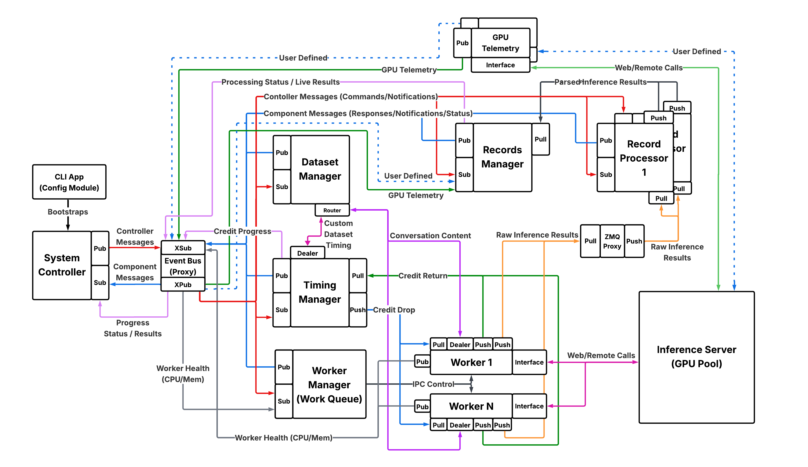

<!--
SPDX-FileCopyrightText: Copyright (c) 2024-2025 NVIDIA CORPORATION & AFFILIATES. All rights reserved.
SPDX-License-Identifier: Apache-2.0
-->

# Architecture of AIPerf

## AIPerf Architecture Overview

AIPerf is designed as a modular, extensible benchmarking framework for generative AI models. Its architecture separates concerns across several core components, enabling flexible configuration, scalable load generation, and robust metric collection. The system supports both local and distributed (Kubernetes) execution, and can be easily extended for new models, endpoints, and benchmarking scenarios.

### System Controller
The System Controller is the central orchestrator that manages the lifecycle and coordination of all major modules involved in a benchmarking run. Its main functions include:

- Registering and initializing core components.
- Orchestrating the start, execution, and shutdown of benchmarking tasks.
- Handling configuration, resource allocation, and inter-module communication.
- Monitoring the overall progress and health of the benchmarking process.
- Managing error handling, cleanup, and graceful termination of all modules.

### Dataset Manager
This is responsible for handling all aspects of input data management during benchmarking runs. Its main functions include:

- Loading datasets from various sources, such as files (JSONL, CSV), synthetic generators, or trace replay formats.
- Parsing and validating input data to ensure it matches the expected format for benchmarking.
- Providing batches or individual samples to the benchmarking workers according to the configured load pattern (e.g., concurrency, request-rate, trace replay).
- Supporting custom dataset types, such as MoonCake traces, for advanced benchmarking scenarios.
- Managing the lifecycle of datasets, including initialization, iteration, and cleanup.

### Timing Manager
This is responsible for controlling and coordinating the timing of requests during benchmarking runs. Its main functions include:

- Scheduling when each request should be sent, based on the selected benchmarking mode (e.g., fixed concurrency, request-rate, or trace replay).
- Managing precise timing to accurately reproduce real-world or synthetic load patterns.
- Supporting advanced timing scenarios, such as replaying traces with specific inter-arrival times or simulating bursty traffic.
- Ensuring that requests are dispatched to workers at the correct intervals, enabling reliable measurement of latency and throughput.
- Providing timing data and statistics for analysis and reporting.

### Worker Manager
This is responsible for orchestrating and managing the pool of worker processes that execute benchmarking tasks. Its main functions include:

- Coordinating with the system controller to spawn and shut down workers that send requests to the inference server.
- Monitoring worker status, progress, and resource usage.
- Handling worker lifecycle events, such as startup, shutdown, and error recovery.

### Worker

This is responsible for executing individual benchmarking tasks. Each worker operates as a process that sends requests to the inference server, collects responses, and records performance metrics. Its main functions include:

- Pulling timing credits from the timing manager.
- Pulling data from the dataset manager for a request.
- Formatting the data for the endpoint.
- Sending requests to the target endpoint according to the specified schedule.
- Recording request and response timestamps.
- Reporting results to the record processors for aggregation and analysis.

### Record Processor
This is responsible for processing and interpreting the responses received from the inference server during benchmarking. Its main functions include:

- Parsing raw inference results to extract relevant metrics, such as latency, output tokens, and correctness.
- Handling different response formats from various model endpoints (e.g., OpenAI, vLLM, Triton, custom APIs).
- Validating and normalizing results to ensure consistency across benchmarking runs.
- Preparing parsed data for further analysis, aggregation, and reporting by other modules (such as the records manager).
- Computing the metrics derived from individual requests.
- Supporting error detection and handling for malformed or unexpected responses.

### Records Manager
This is responsible for managing the collection, organization, and storage of benchmarking records and results. It acts as a central component for handling the data generated during benchmarking runs, such as inference results, timing information, and other metrics. Its main functions include:

- Aggregating data from the records processors, such as inference results, timing information, and metrics.
- Storing records in memory and/or exporting them to files (e.g., CSV, JSON) for later analysis.
- Providing interfaces for querying, filtering, and summarizing benchmarking results.
- Supporting the generation of reports and artifacts for performance evaluation.

### GPU Telemetry (Coming soon)
This connects to a metrics endpoint to gather GPU metrics. This requires DCGM Exporter installed on the server machine.

### Inference Server
This is the endpoint that AIPerf targets to generate benchmarking load.
