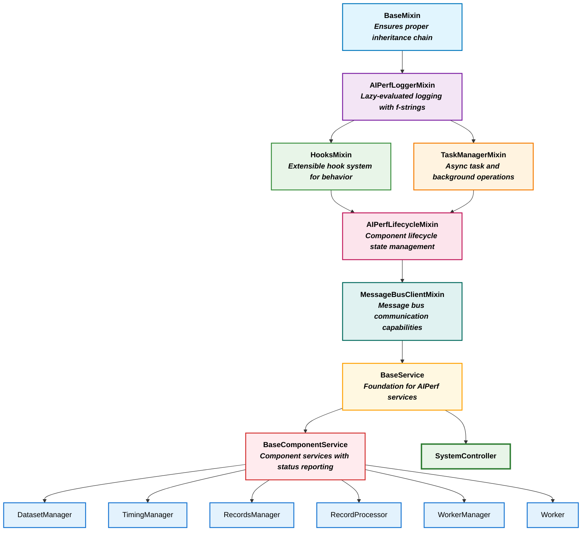

<!--
SPDX-FileCopyrightText: Copyright (c) 2025 NVIDIA CORPORATION & AFFILIATES. All rights reserved.
SPDX-License-Identifier: Apache-2.0
-->

```mermaid
flowchart TD
    %% Core Mixins Hierarchy
    A["BaseMixin<br/><em>Ensures proper inheritance chain</em>"] --> B["AIPerfLoggerMixin<br/><em>Lazy-evaluated logging with f-strings</em>"]
    B --> C["HooksMixin<br/><em>Extensible hook system for behavior</em>"]
    B --> D["TaskManagerMixin<br/><em>Async task and background operations</em>"]

    C --> E["AIPerfLifecycleMixin<br/><em>Component lifecycle state management</em>"]
    D --> E

    E --> F["MessageBusClientMixin<br/><em>Message bus communication capabilities</em>"]

    %% Service Base Classes
    F --> G["BaseService<br/><em>Foundation for AIPerf services</em>"]
    G --> H["BaseComponentService<br/><em>Component services with status reporting</em>"]

    %% Special SystemController path
    G --> I[SystemController]

    %% Main Component Services
    H --> J[DatasetManager]
    H --> K[TimingManager]
    H --> L[RecordsManager]
    H --> M[RecordProcessor]
    H --> N[WorkerManager]
    H --> O[Worker]

    %% Modern styling with better colors and shapes
    classDef baseMixin fill:#e1f5fe,stroke:#0277bd,stroke-width:2px,color:#000000,font-weight:bold
    classDef loggerMixin fill:#f3e5f5,stroke:#7b1fa2,stroke-width:2px,color:#000000,font-weight:bold
    classDef hooksMixin fill:#e8f5e8,stroke:#388e3c,stroke-width:2px,color:#000000,font-weight:bold
    classDef taskMixin fill:#fff3e0,stroke:#f57c00,stroke-width:2px,color:#000000,font-weight:bold
    classDef lifecycleMixin fill:#fce4ec,stroke:#c2185b,stroke-width:2px,color:#000000,font-weight:bold
    classDef messageMixin fill:#e0f2f1,stroke:#00695c,stroke-width:2px,color:#000000,font-weight:bold
    classDef baseService fill:#fff8e1,stroke:#ffa000,stroke-width:2px,color:#000000,font-weight:bold
    classDef componentService fill:#ffebee,stroke:#d32f2f,stroke-width:2px,color:#000000,font-weight:bold
    classDef services fill:#e3f2fd,stroke:#1976d2,stroke-width:2px,color:#000000
    classDef systemController fill:#e8f5e8,stroke:#2e7d32,stroke-width:3px,color:#000000,font-weight:bold

    %% Apply styles
    class A baseMixin
    class B loggerMixin
    class C hooksMixin
    class D taskMixin
    class E lifecycleMixin
    class F messageMixin
    class G baseService
    class H componentService
    class I systemController
    class J,K,L,M,N,O services
```
