<!--
#  SPDX-FileCopyrightText: Copyright (c) 2025 NVIDIA CORPORATION & AFFILIATES. All rights reserved.
#  SPDX-License-Identifier: Apache-2.0
-->
# AIPerf Hook System

> **TODO: Once we create a Mixin for self.stop_event, we can avoid having the user to call `while not self.stop_event.is_set()`**

The AIPerf Hook System provides a powerful, extensible mechanism for implementing lifecycle management and event-driven programming patterns. It enables clean separation of concerns by allowing components to register callbacks that execute at specific points during service execution.

## Core Components

### 1. Hook Types (`AIPerfHook`)

The system defines standard lifecycle hooks:

- **`ON_INIT`**: Initialization phase
- **`ON_RUN`**: Main execution phase
- **`ON_CONFIGURE`**: Configuration updates
- **`ON_START`**: Service startup
- **`ON_STOP`**: Service shutdown
- **`ON_CLEANUP`**: Resource cleanup

And additional usability hooks:

- **`ON_SET_STATE`**: State transitions
- **`AIPERF_TASK`**: Background task registration

### 2. Hook System (`HookSystem`)

Manages hook registration and execution:

```python
class HookSystem:
    def __init__(self, supported_hooks: set[HookType]):
        self.supported_hooks = supported_hooks
        self._hooks: dict[HookType, list[Callable]] = {}
```

### 3. Hooks Mixin (`HooksMixin`)

Provides the interface for hook-enabled classes:

```python
class HooksMixin:
    supported_hooks: set[HookType] = set()

    def __init__(self):
        self._hook_system = HookSystem(self.supported_hooks)
        # Auto-register decorated methods
```

## Usage Patterns

### Basic Implementation - Self Contained
Hooks can be defined and used by the same class

```python
import asyncio
from aiperf.common.hooks import HooksMixin, supports_hooks, on_init, on_cleanup, AIPerfHook

@supports_hooks(AIPerfHook.ON_INIT, AIPerfHook.ON_CLEANUP)
class MyService(HooksMixin):
    def __init__(self):
        self.resources = []
        # Make sure to call __init__ on the HooksMixin
        super().__init__()

    # Hook definitions

    @on_init
    async def _setup_database(self):
        """Initialize database connection."""
        self.db = await connect_to_database()
        self.resources.append(self.db)

    @on_init
    async def _setup_cache(self):
        """Initialize cache system."""
        self.cache = await setup_redis_cache()
        self.resources.append(self.cache)

    @on_cleanup
    async def _cleanup_resources(self):
        """Clean up all resources."""
        await asyncio.gather(*[
            resource.close() for resource in self.resources
        ])

    # Top-level functions that will call the hooks

    async def initialize(self):
        await self.run_hooks_async(AIPerfHook.ON_INIT)

    async def cleanup(self):
        await self.run_hooks_async(AIPerfHook.ON_CLEANUP)
```

### Basic Implementation - Inheritance
Hooks can also be used to call additional functionality defined in subclasses. By calling `await self.run_hooks_async(AIPerfHook.ON_INIT)`, the base class is able to call all registered init functions no matter the subclass that defined it.

```python
from aiperf.common.hooks import HooksMixin, supports_hooks, on_init, on_cleanup, AIPerfHook

@supports_hooks(AIPerfHook.ON_INIT, AIPerfHook.ON_CLEANUP)
class MyHookService(HooksMixin):
    """Defines the top-level functionality that will call the registered hooks."""
    def __init__(self):
        # Make sure to call __init__ on the HooksMixin
        super().__init__()

    async def initialize(self):
        """Runs all of the registered ON_INIT hooks"""
        # Note: Using run_hooks without the _async will run them serially
        await self.run_hooks(AIPerfHook.ON_INIT)

    async def cleanup(self):
        """Runs all of the registered ON_CLEANUP hooks"""
        await self.run_hooks_async(AIPerfHook.ON_CLEANUP)


class CustomService(MyHookService):
    """Defines functions that will be called by the lifecycle hooks"""
    @on_init
    async def _setup_database(self):
        """Initialize database connection."""
        self.db = await connect_to_database()
        self.resources.append(self.db)

    @on_init
    async def _setup_cache(self):
        """Initialize cache system."""
        self.cache = await setup_redis_cache()
        self.resources.append(self.cache)

    @on_cleanup
    async def _cleanup_cache(self):
        await self.cache.close()

    @on_cleanup
    async def _cleanup_database(self):
        await self.db.close()
```


### Hook Execution Flow

```mermaid
sequenceDiagram
    participant C as 📱 Client
    participant CS as 🔧 CustomService
    participant MHS as ⚙️ MyHookService
    participant HM as 🎯 HooksMixin

    Note over C, HM: Hook System Setup & Registration
    MHS-->>HM: 📋 @supports_hooks(AIPerfHook.ON_INIT, ...)
    CS-->>HM: 🔗 @on_init (registration)

    Note over C, HM: Hook Execution Flow
    C->>+MHS: 🚀 initialize()
    MHS->>+HM: ⚡ run_hooks_async(ON_INIT)

    Note over HM: Parallel Hook Execution
    loop 🔄 For each registered hook
        HM->>+CS: 🎬 Execute hook function
        CS-->>-HM: ✅ Hook completed
    end

    HM-->>-MHS: 🏁 All hooks completed
    MHS-->>-C: ✨ Initialization complete

    %% Custom styling for better visibility
    %%{init: {
        'theme': 'dark',
        'themeVariables': {
            'primaryColor': '#2196f3',
            'primaryTextColor': '#ffffff',
            'primaryBorderColor': '#1976d2',
            'lineColor': '#90a4ae',
            'secondaryColor': '#9c27b0',
            'tertiaryColor': '#4caf50',
            'background': '#263238',
            'noteTextColor': '#ffffff',
            'noteBkgColor': '#37474f',
            'noteBorderColor': '#546e7a'
        }
    }}%%
```



### Inheritance and Hook Composition

```python
@supports_hooks(AIPerfHook.ON_INIT, AIPerfHook.ON_CLEANUP)
class BaseService(HooksMixin):
    @on_init
    async def base_init(self):
        self.logger.info("Base service initializing")

@supports_hooks(AIPerfHook.ON_START)  # Adds ON_START to inherited hooks
class WebService(BaseService):
    @on_init
    async def web_init(self):
        self.logger.info("Web service initializing")

    @on_start
    async def start_server(self):
        self.server = await start_web_server()
```

**Hook inheritance flow:**

```mermaid
graph TD
    A["**BaseService**"] --> B["*WebService*"]
    A --> C["<b>Hooks:</b><br/>• ON_INIT<br/>• ON_CLEANUP"]
    B --> D["<b>Inherited Hooks:</b><br/>• ON_INIT<br/>• ON_CLEANUP<br/><br/><b>Added Hook:</b><br/>• ON_START"]

    E["Hook Execution<br/>Order"] --> F["base_init()"]
    F --> G["web_init()"]

    %% Styling for better visibility
    style A fill:#bbdefb,stroke:#1976d2,stroke-width:2px,color:#000
    style B fill:#c8e6c9,stroke:#388e3c,stroke-width:2px,color:#000
    style C fill:#e1f5fe,stroke:#0277bd,stroke-width:2px,color:#000
    style D fill:#f3e5f5,stroke:#7b1fa2,stroke-width:2px,color:#000
    style E fill:#fff3e0,stroke:#f57c00,stroke-width:2px,color:#000
    style F fill:#fce4ec,stroke:#c2185b,stroke-width:2px,color:#000
    style G fill:#fce4ec,stroke:#c2185b,stroke-width:2px,color:#000

    %% Better arrow styling
    linkStyle 0 stroke:#666,stroke-width:2px
    linkStyle 1 stroke:#666,stroke-width:2px
    linkStyle 2 stroke:#666,stroke-width:2px
    linkStyle 3 stroke:#666,stroke-width:2px
    linkStyle 4 stroke:#666,stroke-width:2px
```



## Hook Registration and Execution Order

Hooks are registered in a **predictable, deterministic order** that ensures proper initialization flow:

### 1. **Across Classes**: Base → Derived
```python
class BaseService(HooksMixin):
    @on_init
    async def base_setup(self):        # Registered 1st
        pass

class MyService(BaseService):
    @on_init
    async def service_setup(self):     # Registered 2nd
        pass
```

### 2. **Within Classes**: Definition Order
```python
class MyService(BaseService):
    @on_init
    async def setup_database(self):    # Registered 1st
        pass

    @on_init
    async def setup_cache(self):       # Registered 2nd
        pass

    @on_init
    async def setup_metrics(self):     # Registered 3rd
        pass
```

> 💡 **Key Point**: Base class hooks always run before derived class hooks, ensuring that foundational components (communication, signals) are initialized before service-specific functionality.

> ⚠️ **Important**: To maintain this execution order, you must use `run_hooks()` (serial execution). Using `run_hooks_async()` runs hooks concurrently and **does not guarantee execution order**, even though registration order is still deterministic.

```python
# ✅ Preserves execution order (serial)
await self.run_hooks(AIPerfHook.ON_INIT)

# ❌ No execution order guarantee (concurrent)
await self.run_hooks_async(AIPerfHook.ON_INIT)
```

## Advanced Features

### Runtime Hook Registration

```python
service = MyService()

async def custom_monitoring_hook():
    await send_metrics_to_monitoring_system()

# Register hook at runtime using class instance
service.register_hook(AIPerfHook.ON_START, custom_monitoring_hook)
```

### Serial vs Concurrent Execution

```python
# Serial execution (hooks run one after another). Each one is awaited individually.
await self.run_hooks(AIPerfHook.ON_INIT)

# Concurrent execution (all hooks run simultaneously and are gathered at the end)
await self.run_hooks_async(AIPerfHook.ON_INIT)
```

## Error Handling

### Unsupported Hook Error
When a hook decorator is defined on a function within a class that does not support that hook type, an exception is raised. The reason for this is to cause traceability and prevent users from trying to hook into a functionality that is not implemented.

```python
@supports_hooks(AIPerfHook.ON_INIT)
class LimitedService(HooksMixin):
    @on_start  # This will raise UnsupportedHookError
    async def invalid_hook(self):
        pass
```

### Multi-Error Handling

When multiple hooks fail, the system collects all errors:

```python
try:
    await self.run_hooks(AIPerfHook.ON_INIT)
except AIPerfMultiError as e:
    for error in e.errors:
        self.logger.error(f"Hook failed: {error}")
```

## Best Practices

### 1. Hook Naming Convention

```python
class MyService(BaseService):
    @on_init
    async def _initialize_database(self):  # Prefix with underscore
        pass

    @on_cleanup
    async def _cleanup_connections(self):  # Descriptive names
        pass
```

### 2. Resource Management

```python
@on_init
async def _setup_resources(self):
    self.resources = []

@on_cleanup
async def _cleanup_resources(self):
    for resource in reversed(self.resources):  # LIFO cleanup
        await resource.close()
```

### 3. Error Isolation

```python
@on_init
async def _safe_initialization(self):
    try:
        await risky_operation()
    except Exception as e:
        self.logger.error(f"Non-critical init failed: {e}")
        # Don't re-raise if operation is optional
```

## Performance Considerations

- **Concurrent execution**: Use `run_hooks_async()` for independent hooks
- **Serial execution**: Use `run_hooks()` when hooks have dependencies (ie. base class hooks must be called before subclass hooks)
- **Hook registration**: Happens once during `__init__`, minimal overhead
- **Memory usage**: Hooks are stored as method references bound to self, not duplicated

The AIPerf Hook System provides a robust foundation for building extensible, maintainable services with clear lifecycle management and event-driven architecture patterns.

## The Special `@aiperf_task` Decorator

The `@aiperf_task` decorator is unique among the AIPerf hooks because it doesn't follow the typical hook execution pattern. Instead of being executed at specific lifecycle moments like other hooks, functions decorated with `@aiperf_task` are **automatically registered as long-running background tasks** that start when the service initializes and run continuously until the service shuts down.

### How `@aiperf_task` Works

The `@aiperf_task` decorator works through the `AIPerfTaskMixin` class, which provides automatic task lifecycle management:

1. **Discovery**: All methods decorated with `@aiperf_task` are discovered during class initialization
2. **Automatic Startup**: Tasks are automatically started during the `ON_INIT` hook phase
3. **Registration**: Each task is created using `asyncio.create_task()` and stored in `registered_tasks`
4. **Automatic Shutdown**: Tasks are cancelled and cleaned up during the `ON_STOP` hook phase

### Using `AIPerfTaskMixin`

To use `@aiperf_task` decorated methods, your class must inherit from `AIPerfTaskMixin`:

```python
from aiperf.common.hooks import AIPerfTaskMixin, aiperf_task
import asyncio

class BackgroundService(AIPerfTaskMixin):
    def __init__(self):
        self.stop_event = asyncio.Event()
        self.metrics = {}
        super().__init__()  # Important: call super().__init__()

    @aiperf_task
    async def _monitor_system_health(self):
        """Continuously monitor system health metrics."""
        while not self.stop_event.is_set():
            try:
                # Collect system metrics
                cpu_usage = await get_cpu_usage()
                memory_usage = await get_memory_usage()

                self.metrics.update({
                    'cpu': cpu_usage,
                    'memory': memory_usage,
                    'timestamp': time.time()
                })

                # Check if metrics exceed thresholds
                if cpu_usage > 90:
                    self.logger.warning(f"High CPU usage: {cpu_usage}%")

                await asyncio.sleep(5)  # Poll every 5 seconds

            except asyncio.CancelledError:
                self.logger.info("Health monitoring task cancelled")
                break
            except Exception as e:
                self.logger.error(f"Error in health monitoring: {e}")
                await asyncio.sleep(1)

    # Manual lifecycle control
    async def start_service(self):
        """Start the service and all background tasks."""
        await self.run_hooks(AIPerfHook.ON_INIT)  # This starts all @aiperf_task methods

    async def stop_service(self):
        """Stop the service and all background tasks."""
        self.stop_event.set()  # Signal tasks to stop
        await self.run_hooks(AIPerfHook.ON_STOP)   # This cancels and waits for all tasks
```

### Key Differences from Other Hooks

| Aspect | Regular Hooks (`@on_init`, `@on_start`, etc.) | `@aiperf_task` |
|--------|-----------------------------------------------|----------------|
| **Execution** | Called once at specific lifecycle events | Run continuously as background tasks |
| **Lifecycle** | Short-lived, return after completion | Long-lived, run until service shutdown |
| **Cancellation** | Not applicable | Automatically cancelled on service stop |
| **Purpose** | Setup, teardown, event handling | Background processing, monitoring, polling |
| **Mixin Required** | `HooksMixin` | `AIPerfTaskMixin` |

### Task Lifecycle Management

The `AIPerfTaskMixin` handles the complete lifecycle of `@aiperf_task` decorated methods:

```python
class AIPerfTaskMixin(HooksMixin):
    def __init__(self):
        super().__init__()
        self.registered_tasks: dict[str, asyncio.Task] = {}

    @on_init
    async def _start_tasks(self):
        """Start all the registered tasks."""
        for hook in self.get_hooks(AIPerfHook.AIPERF_TASK):
            self.registered_tasks[hook.__name__] = asyncio.create_task(hook())

    @on_stop
    async def _stop_tasks(self):
        """Stop all the registered tasks."""
        for task in self.registered_tasks.values():
            task.cancel()

        # Wait for all tasks to complete
        with contextlib.suppress(asyncio.CancelledError):
            await asyncio.gather(*self.registered_tasks.values())
```

### Best Practices for `@aiperf_task`

#### 1. **Always Handle Cancellation**
```python
@aiperf_task
async def _background_worker(self):
    try:
        while not self.stop_event.is_set():
            await do_work()
            await asyncio.sleep(1)
    except asyncio.CancelledError:
        # Perform cleanup if necessary
        await cleanup_resources()
        raise  # Re-raise to properly cancel the task
```

#### 2. **Use Stop Events for Graceful Shutdown**
```python
@aiperf_task
async def _poller(self):
    while not self.stop_event.is_set():
        try:
            await poll_external_service()
            await asyncio.sleep(10)
        except asyncio.CancelledError:
            break
```

#### 3. **Include Error Handling and Recovery**
```python
@aiperf_task
async def _resilient_worker(self):
    retry_count = 0
    max_retries = 3

    while not self.stop_event.is_set():
        try:
            await potentially_failing_operation()
            retry_count = 0  # Reset on success

        except asyncio.CancelledError:
            break
        except Exception as e:
            retry_count += 1
            if retry_count > max_retries:
                self.logger.error(f"Task failed {max_retries} times, stopping")
                break

            backoff_time = min(2 ** retry_count, 60)  # Exponential backoff
            await asyncio.sleep(backoff_time)
```

#### 4. **Avoid Blocking Operations**
```python
@aiperf_task
async def _file_processor(self):
    while not self.stop_event.is_set():
        try:
            # Use asyncio.to_thread for blocking I/O
            result = await asyncio.to_thread(cpu_intensive_operation)
            await process_result(result)

        except asyncio.CancelledError:
            break
```

### Real-World Use Cases

#### **Network Communication Tasks**
```python
@aiperf_task
async def _message_receiver(self):
    """Continuously receive messages from ZMQ socket."""
    while not self.stop_event.is_set():
        try:
            message = await self.socket.recv_string()
            await self.handle_message(message)
        except asyncio.CancelledError:
            break
```

#### **Periodic Maintenance Tasks**
```python
@aiperf_task
async def _cleanup_old_files(self):
    """Clean up old log files every hour."""
    while not self.stop_event.is_set():
        try:
            await cleanup_logs_older_than(days=7)
            await asyncio.sleep(3600)  # Wait 1 hour
        except asyncio.CancelledError:
            break
```

#### **Health Check and Heartbeat Tasks**
```python
@aiperf_task
async def _send_heartbeat(self):
    """Send periodic heartbeat messages."""
    while not self.stop_event.is_set():
        try:
            heartbeat = HeartbeatMessage(
                service_id=self.service_id,
                timestamp=time.time(),
                status="healthy"
            )
            await self.publish_heartbeat(heartbeat)
            await asyncio.sleep(self.heartbeat_interval)
        except asyncio.CancelledError:
            break
```

### Task Registry and Debugging

All `@aiperf_task` decorated methods are stored in `self.registered_tasks` with their function name as the key:

```python
# Access running tasks programmatically
for task_name, task in self.registered_tasks.items():
    print(f"Task {task_name}: {'running' if not task.done() else 'finished'}")

# Check if a specific task is running
if '_monitor_system_health' in self.registered_tasks:
    task = self.registered_tasks['_monitor_system_health']
    if not task.done():
        print("Health monitoring is active")
```

### Integration with Services

When using with AIPerf services that inherit from `BaseService`, the lifecycle is automatically managed:

```python
from aiperf.common.service.base_service import BaseService

class MyService(BaseService):  # BaseService inherits from AIPerfTaskMixin
    @aiperf_task
    async def _background_processor(self):
        while not self.stop_event.is_set():
            await self.process_work()
            await asyncio.sleep(1)

    # Tasks will automatically start when service initializes
    # Tasks will automatically stop when service shuts down
```
